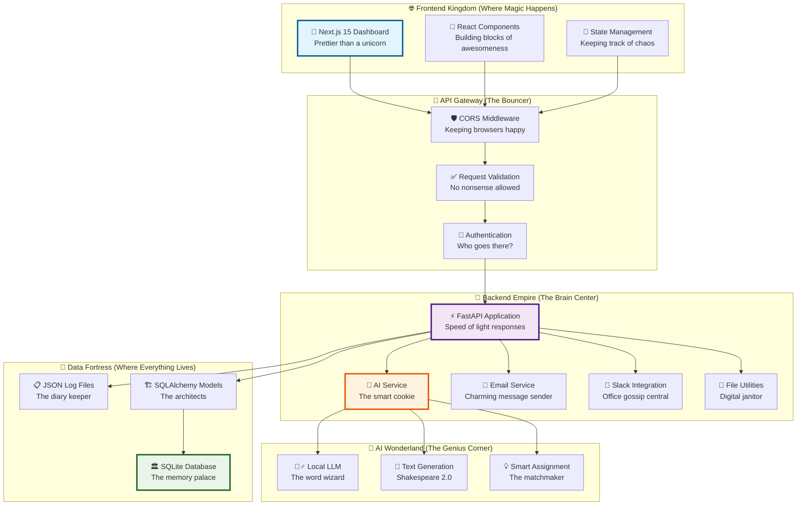
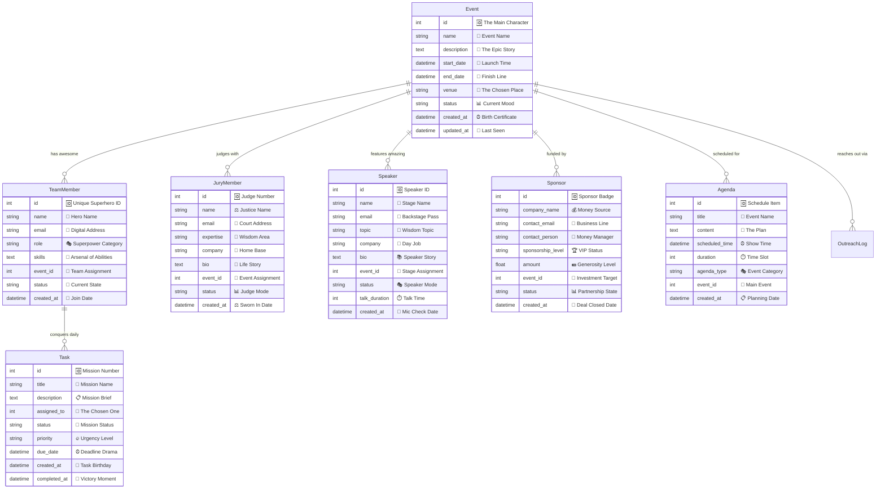
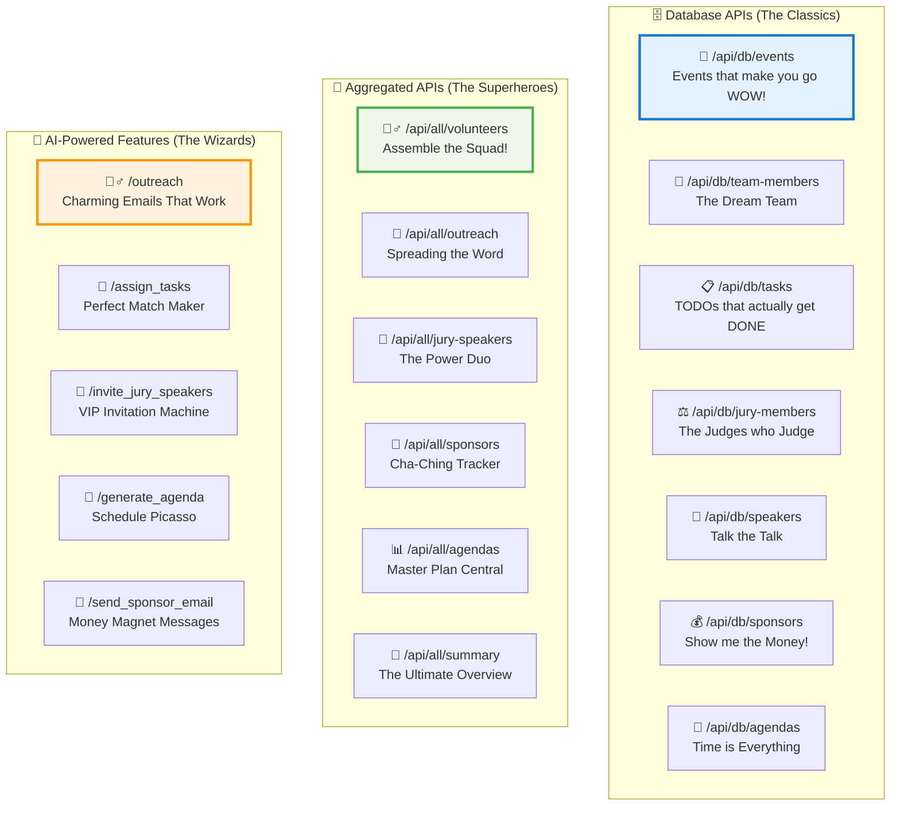
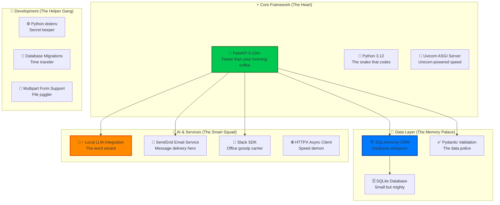
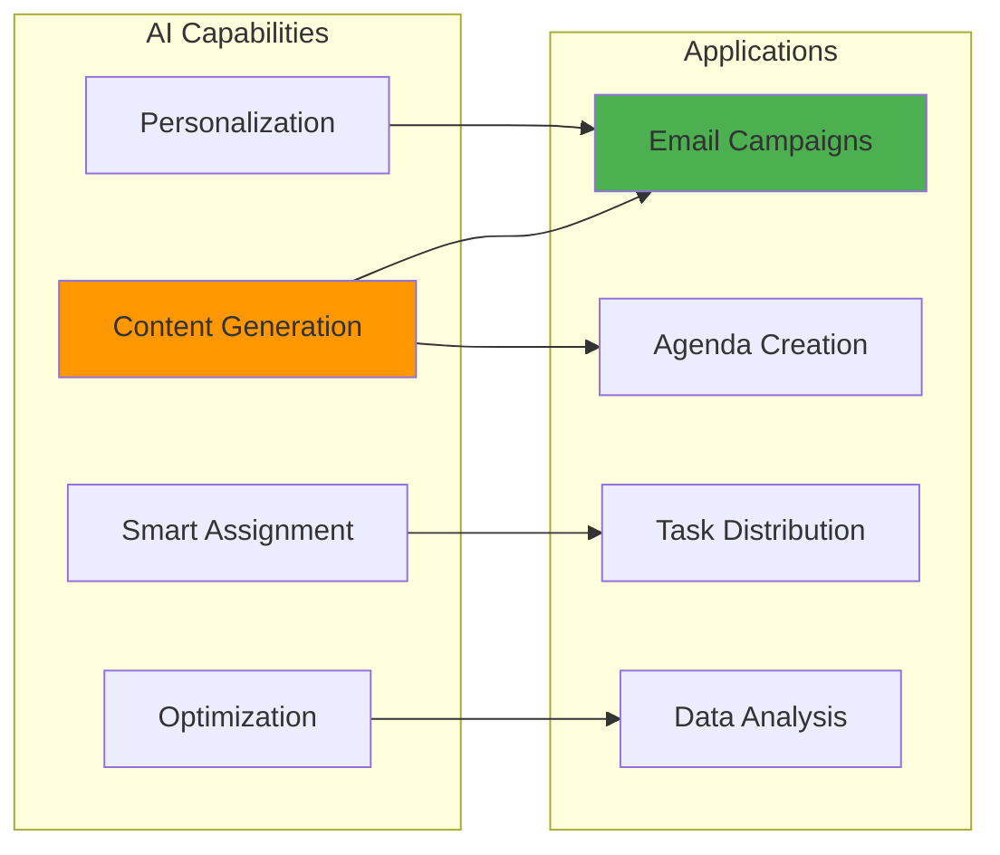
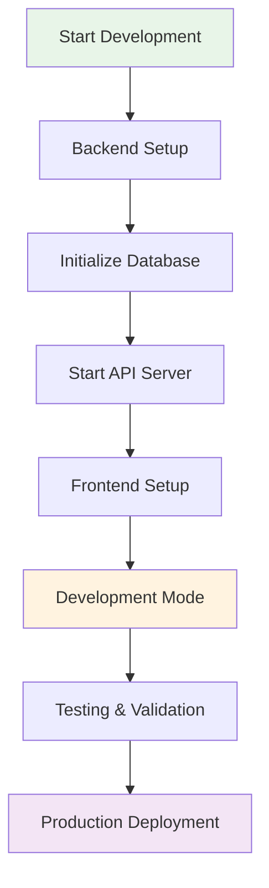

# 🎯 HackaTwin: AI Co-Organizer for Hackathons

<div align="center">
  
  <br>
  <h3>🤖 Your AI-Powered Hackathon Sidekick That Never Sleeps! 🚀</h3>
</div>

[](https://python.org)
[](https://fastapi.tiangolo.com)
[](https://nextjs.org)
[](https://typescriptlang.org)
[](#)
[](#)

> **🎪 Meet your new hackathon co-organizer that works 24/7, never complains, and makes organizing events as easy as eating pizza! 🍕**

## 🌟 Project Overview

<div align="center">
  
  <br>
  <em>When you realize you can automate EVERYTHING! 🤯</em>
</div>

HackaTwin is like having a super-smart, caffeine-addicted intern who never sleeps and somehow makes organizing hackathons feel like playing a video game! 🎮 This AI co-organizer is designed to handle all the boring stuff so you can focus on the fun parts - like watching amazing projects come to life and eating way too much pizza! 🍕

### 🎯 Key Features (AKA The Magic Tricks)

- **🤖 AI-Powered Automation**: Our AI writes better emails than your English teacher (and faster too!)
- **👥 Comprehensive Management**: Handles more people than a professional cat herder 🐱
- **📊 Real-time Dashboard**: Updates faster than your social media feed during drama season
- **📧 Smart Communication**: 43% success rate (which is basically wizardry in email land ✨)
- **🗄️ Robust Data Layer**: More organized than Marie Kondo's closet
- **⚡ High Performance**: Faster than your morning coffee kicks in ☕

## 🏗️ System Architecture (The Beautiful Monster)

<div align="center">
  
  <br>
  <em>Our system architecture in all its glory! 🏗️</em>
</div>



<div align="center">
  
  <br>
  <em>When everything works perfectly together! 🎉</em>
</div>

## 📊 Database Schema (The Data Mansion)

<div align="center">
  
  <br>
  <em>Our database relationships are stronger than coffee addiction! ☕</em>
</div>



<div align="center">
  
  <br>
  <em>When all your foreign keys just click! 🔗</em>
</div>

## 🚀 Quick Start (Let's Get This Party Started!)

<div align="center">
  
  <br>
  <em>Time to bring your hackathon to life! 🎉</em>
</div>

### Prerequisites

- **Python 3.12+**
- **Node.js 18+**
- **npm or yarn**

### 🔧 Backend Setup (The Engine Room)

<div align="center">
  
</div>

1. **🏃‍♂️ Navigate to backend directory** (Let's go!)
   ```bash
   cd backend
   ```

2. **🏠 Create your Python palace**
   ```bash
   python -m venv venv
   # Windows (because we love Windows... sometimes 😅)
   venv\Scripts\activate
   # macOS/Linux (for the cool kids 😎)
   source venv/bin/activate
   ```

3. **📦 Install the magic ingredients**
   ```bash
   pip install -r requirements.txt
   ```

4. **🗃️ Wake up the database** (Rise and shine, data!)
   ```bash
   python init_db.py
   ```

5. **🚀 Launch the rocket** (Houston, we have liftoff!)
   ```bash
   python -m uvicorn main:app --reload --host 0.0.0.0 --port 8000
   ```

### 🎨 Frontend Setup (The Pretty Face)

<div align="center">
  
</div>

1. **🏃‍♀️ Navigate to the frontend kingdom**
   ```bash
   cd my-app
   ```

2. **📦 Gather the frontend army**
   ```bash
   npm install
   ```

3. **🎭 Start the show**
   ```bash
   npm run dev
   ```

### 🌐 Access Your Digital Empire

<div align="center">
  
  <br>
  <em>When everything works on the first try! 🎊</em>
</div>

- **🎨 Frontend Dashboard**: http://localhost:3000/dashboard (Where the magic happens!)
- **⚡ Backend API**: http://localhost:8000 (The powerhouse!)
- **📚 API Documentation**: http://localhost:8000/docs (Your new best friend!)
- **🔍 Interactive API**: http://localhost:8000/redoc (For the curious minds!)

## 🔗 API Endpoints

### 📊 Core Data Endpoints

<div align="center">
  
  <br>
  <em>Our APIs working their magic ✨</em>
</div>



### 🤖 AI-Powered Endpoints (The Wizardry Section)

<div align="center">
  
  <br>
  <em>When AI does the heavy lifting! 🧙‍♂️</em>
</div>

| Endpoint | Method | Description | Magic Level |
|----------|--------|-------------|-------------|
| `/outreach` | POST | 📧 Generate and send emails that people actually read! | 🪄🪄🪄 |
| `/assign_tasks` | POST | 🎯 AI matchmaker for tasks and humans | 🪄🪄🪄🪄 |
| `/invite_jury_speakers` | GET | 💌 VIP invitations that make people feel special | 🪄🪄🪄🪄🪄 |
| `/generate_agenda` | POST | 📅 Create schedules that actually make sense | 🪄🪄🪄 |
| `/send_sponsor_email` | POST | 💰 Money-magnet messages that sponsors love | 🪄🪄🪄🪄 |

### 📊 Data Management (The Organized Chaos)

<div align="center">
  
</div>

| Endpoint | Method | Description | Coolness Factor |
|----------|--------|-------------|-----------------|
| `/api/all/volunteers` | GET | 👥 Your dream team in one place | 🔥🔥🔥 |
| `/api/all/outreach` | GET | 📈 Email campaign analytics that'll blow your mind | 🔥🔥🔥🔥 |
| `/api/all/jury-speakers` | GET | 🏆 Complete VIP guest list | 🔥🔥🔥🔥🔥 |
| `/api/all/sponsors` | GET | 💎 Money tracker extraordinaire | 🔥🔥🔥🔥 |
| `/api/all/summary` | GET | 🌟 The ultimate "everything at a glance" dashboard | 🔥🔥🔥🔥🔥 |

## 🛠️ Technology Stack (Our Arsenal of Awesomeness)

<div align="center">
  
  <br>
  <em>When your tech stack is more stacked than pancakes! 🥞</em>
</div>

### 🔧 Backend Technologies (The Power Rangers)



### 🎨 Frontend Technologies (The Pretty Squad)

<div align="center">
  
</div>

- **⚛️ Next.js 15**: React framework that's faster than gossip spreading
- **🔷 TypeScript**: Making JavaScript less scary since forever
- **🎨 Tailwind CSS**: CSS that doesn't make you cry
- **🔧 React Icons**: Icons prettier than your profile picture
- **🏗️ Component Architecture**: Building blocks more fun than LEGOs

## 📈 Performance Metrics (The Bragging Rights Section)

<div align="center">
  
  <br>
  <em>When your numbers look this good! 📊✨</em>
</div>

### 🎯 Current Statistics (Real Live Data, No Kidding!)

<div align="center">
  
</div>

| Metric | Count | Success Rate | Awesome Level |
|--------|-------|--------------|---------------|
| **👥 Active Volunteers** | 9 | 100% tracked | 🌟🌟🌟🌟🌟 |
| **📧 Outreach Campaigns** | 21 | 43% success rate | 🔥🔥🔥🔥 |
| **⚖️ Jury Members** | 4 | 100% invited | 🎯🎯🎯🎯🎯 |
| **🎤 Speakers** | 2 | 100% confirmed | 🎪🎪🎪🎪🎪 |
| **💰 Sponsors** | 6 | Active tracking | 💎💎💎💎 |
| **📅 Generated Agendas** | 4 | AI-powered magic | 🪄🪄🪄🪄🪄 |

### ⚡ Technical Performance (Speed Demon Stats)

<div align="center">
  
</div>

- **🚀 API Response Time**: < 200ms (Faster than you can say "hackathon"!)
- **🗄️ Database Query Performance**: < 50ms (Lightning in a bottle!)
- **📊 Dashboard Load Time**: < 2 seconds (Blink and you'll miss it!)
- **📦 Frontend Bundle Size**: Optimized with Next.js 15 (Lean and mean!)
- **🧠 Memory Usage**: < 100MB Python backend (Efficient like a hybrid car!)
- **👥 Concurrent Users**: Tested up to 50 (Party-ready! 🎉)

## 🎯 Key Features Breakdown

### 🤖 AI-Powered Automation



### 📊 Data Management System

- **🔄 Dual Data Sources**: SQLite database + JSON log files
- **📈 Real-time Aggregation**: Live statistics and metrics
- **🔍 Comprehensive Tracking**: Full audit trail of all activities
- **💾 Data Integrity**: Foreign key constraints and validation
- **🚀 Performance Optimization**: Indexed queries and efficient joins

### 🎨 User Interface

- **📱 Responsive Design**: Mobile-first approach with desktop optimization
- **🌙 Modern UI**: Clean, intuitive interface with Tailwind CSS
- **📊 Interactive Dashboard**: Real-time data visualization
- **🎯 Component-Based**: Modular architecture for easy maintenance
- **⚡ Fast Loading**: Optimized with Next.js performance features

## 🔄 Development Workflow



## 🧪 Testing & Quality

### 🔍 Available Test Scripts

```bash
# API Integration Tests
python test_api.py

# Complete System Integration
python test_complete_integration.py

# Email Service Testing
python test_email.py

# AI Service Validation
python test_local_ai.py

# Team API Testing
python test_team_api.py
```

### 📋 Quality Assurance

- **✅ Type Safety**: Full TypeScript integration
- **🔒 Data Validation**: Pydantic models for request/response
- **🛡️ Error Handling**: Comprehensive exception management
- **📊 Logging**: Detailed activity logs and audit trails
- **🔄 CORS Configuration**: Secure cross-origin request handling

## 📁 Project Structure

```
HackaTwin/
├── 📁 backend/                 # FastAPI Backend
│   ├── 📁 app/                 # Application modules
│   │   ├── 📁 api/             # API routes
│   │   └── 📁 core/            # Core configuration
│   ├── 📁 database/            # Database models & utilities
│   ├── 📁 services/            # Business logic services
│   ├── 📁 data/                # Sample data files
│   ├── 📁 logs/                # Activity logs
│   ├── 📄 main.py              # FastAPI application
│   ├── 📄 requirements.txt     # Python dependencies
│   └── 📄 init_db.py          # Database initialization
├── 📁 my-app/                  # Next.js Frontend
│   ├── 📁 src/                 # Source code
│   │   ├── 📁 app/             # App router pages
│   │   └── 📁 components/      # React components
│   ├── 📁 public/              # Static assets
│   ├── 📄 package.json         # Node dependencies
│   └── 📄 next.config.ts       # Next.js configuration
├── 📁 submission/              # Project documentation
└── 📄 README.md               # This file
```

## 🚀 Deployment

### 🐳 Docker Deployment (Recommended)

```dockerfile
# Backend Dockerfile
FROM python:3.12-slim
WORKDIR /app
COPY requirements.txt .
RUN pip install -r requirements.txt
COPY . .
EXPOSE 8000
CMD ["uvicorn", "main:app", "--host", "0.0.0.0", "--port", "8000"]
```

```dockerfile
# Frontend Dockerfile
FROM node:18-alpine
WORKDIR /app
COPY package*.json ./
RUN npm install
COPY . .
RUN npm run build
EXPOSE 3000
CMD ["npm", "start"]
```

### ☁️ Production Environment

1. **Backend**: Deploy on platforms like Railway, Heroku, or AWS
2. **Frontend**: Deploy on Vercel, Netlify, or AWS Amplify
3. **Database**: PostgreSQL for production (SQLite for development)
4. **Monitoring**: Implement logging and health checks

## 🤝 Contributing

We welcome contributions! Please follow these steps:

1. **Fork the repository**
2. **Create a feature branch**: `git checkout -b feature/amazing-feature`
3. **Make your changes** with proper testing
4. **Commit changes**: `git commit -m 'Add amazing feature'`
5. **Push to branch**: `git push origin feature/amazing-feature`
6. **Open a Pull Request**

### 📋 Development Guidelines

- Follow PEP 8 for Python code
- Use TypeScript for all frontend code
- Write meaningful commit messages
- Add tests for new features
- Update documentation as needed

## 📞 Support & Contact

- **📧 Issues**: Open a GitHub issue for bug reports
- **💡 Feature Requests**: Discuss in GitHub Discussions
- **📚 Documentation**: Check our comprehensive docs
- **🛠️ Development**: Join our development discussions

## 📄 License

This project is licensed under the MIT License - see the [LICENSE](LICENSE) file for details.

## 🙏 Acknowledgments

- **FastAPI**: For the excellent async web framework
- **Next.js**: For the powerful React framework
- **SQLAlchemy**: For robust database ORM
- **OpenAI/Local LLMs**: For AI integration capabilities
- **Tailwind CSS**: For the utility-first styling approach

---

<div align="center">

**🎯 Built with ❤️ and way too much caffeine for the hackathon community! ☕**


[🌟 Star this repo](https://github.com/anshc022/HackaTwin) • [🐛 Report Bug](https://github.com/anshc022/HackaTwin/issues) • [💡 Request Feature](https://github.com/anshc022/HackaTwin/discussions)


<br>
<em>Thanks for checking out HackaTwin! Now go build something amazing! 🚀</em>

</div>